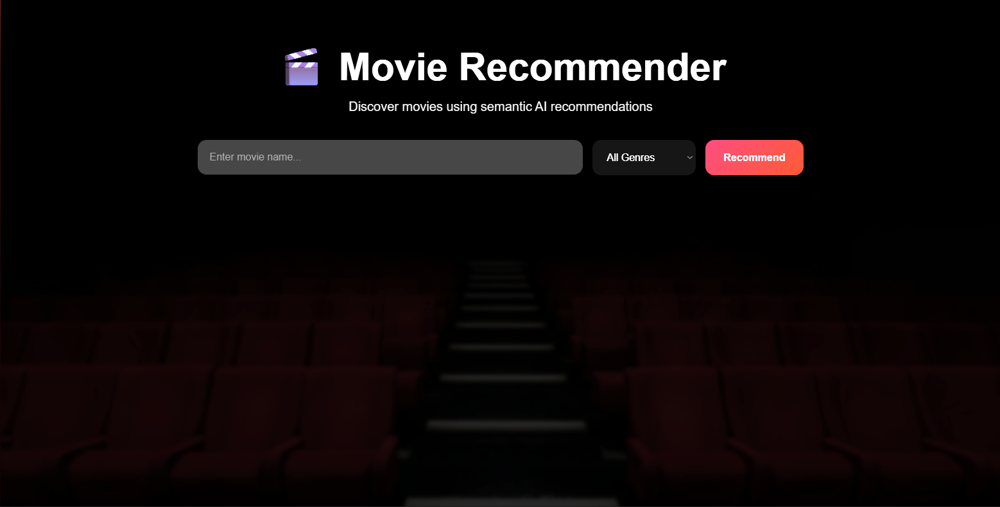
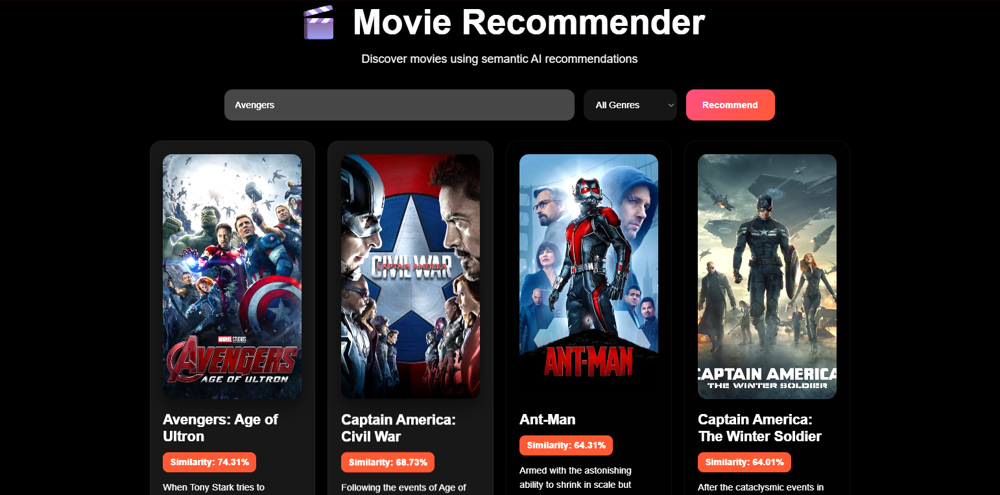

# 🎬 AI-Powered Movie Recommendation System


A full-stack AI-powered movie recommendation platform that uses semantic embeddings and cosine similarity to recommend movies based on contextual understanding instead of traditional keyword matching.

The system analyzes movie overviews, genres, cast, keywords, and directors to generate highly relevant recommendations using Sentence Transformers and NLP-based semantic similarity.

---

# 🔗 Live Demo

### Frontend
https://ai-movie-recommender-system.netlify.app

### Backend API
https://movie-recommender-api-wawc.onrender.com/docs

---

# ✨ Key Features

- Semantic AI movie recommendations
- Sentence Transformer embeddings
- Cosine similarity recommendation engine
- FastAPI REST API backend
- Responsive modern frontend UI
- Movie poster integration using TMDB API
- Autocomplete movie search
- Genre-based filtering
- Fuzzy movie title matching
- Similarity scoring for recommendations
- Full-stack production deployment

---

# 📸 Screenshots

## Home Page



---

## Recommendation Results



---

# 🧠 How It Works

1. Movie metadata is cleaned and preprocessed.
2. Important movie attributes are combined into a single `tags` column:
   - Overview
   - Genres
   - Keywords
   - Cast
   - Director
3. Sentence Transformer generates semantic embeddings for each movie.
4. Cosine similarity compares embedding vectors.
5. FastAPI serves recommendation results through REST APIs.
6. Frontend fetches and displays recommendations dynamically with posters and filters.

---

# 🛠️ Tech Stack

## Backend
- Python
- FastAPI
- Pandas
- NumPy
- Scikit-learn
- Requests
- Sentence Transformers

## Frontend
- HTML
- CSS
- JavaScript

## APIs
- TMDB API

## Deployment
- Render (Backend)
- Netlify (Frontend)

---

# 📂 Project Structure

```text
movie-recommender/
│
├── backend/
│   ├── main.py
│   ├── movies.pkl
│   ├── similarity.pkl
│   ├── requirements.txt
│   ├── .env.example
│
├── frontend/
│   ├── index.html
│   ├── style.css
│   ├── script.js
│
├── notebook/
│   ├── movie_recommender_final.ipynb
│
├── screenshots/
│   ├── home.png
│   ├── results.png
│
├── .gitignore
├── README.md
```

---

# ⚙️ Installation & Setup

## 1️⃣ Clone Repository

```bash
git clone https://github.com/YOUR_USERNAME/movie-recommender.git
cd movie-recommender
```

---

## 2️⃣ Backend Setup

Navigate to backend directory:

```bash
cd backend
```

Create virtual environment:

### Windows

```bash
python -m venv venv
venv\Scripts\activate
```

### Mac/Linux

```bash
python3 -m venv venv
source venv/bin/activate
```

Install dependencies:

```bash
pip install -r requirements.txt
```

Create `.env` file:

```env
TMDB_API_KEY=YOUR_TMDB_API_KEY
```

Run backend server:

```bash
python -m uvicorn main:app --reload
```

Backend runs at:

```text
http://127.0.0.1:8000
```

---

## 3️⃣ Frontend Setup

Open:

```text
frontend/index.html
```

using **Live Server** in VS Code.

---

# 🔌 API Endpoints

## GET `/movies`

Returns autocomplete movie suggestions.

### Example

```http
GET /movies?q=ava
```

---

## GET `/genres`

Returns all available movie genres.

---

## POST `/recommend`

Returns semantic movie recommendations.

### Example Request

```json
{
  "movie_name": "Avatar",
  "num_recommendations": 5,
  "genre_filter": "Action"
}
```

---

# 🧪 Example Output

```json
{
  "title": "Aliens",
  "similarity_score": 60.96,
  "genres": ["Horror", "Action", "ScienceFiction"]
}
```

---

# 🧠 AI Concepts Used

- Semantic Embeddings
- NLP-based Recommendation Systems
- Cosine Similarity
- Sentence Transformers
- Vector Similarity Search
- Content-Based Filtering

---

# 📈 Future Improvements

- User authentication
- Personalized watchlists
- Collaborative filtering
- FAISS vector search
- User ratings and reviews
- Recommendation history
- Advanced filtering
- Docker containerization

---

# 📄 Resume Description

Built a full-stack AI-powered movie recommendation system using Sentence Transformers, FastAPI, cosine similarity, and TMDB metadata. Implemented semantic movie similarity, autocomplete, genre filtering, fuzzy search, movie poster integration, and a responsive frontend interface. Deployed the application using Render and Netlify with secure environment variable management.

---

# 👨‍💻 Author

**Mokshit**